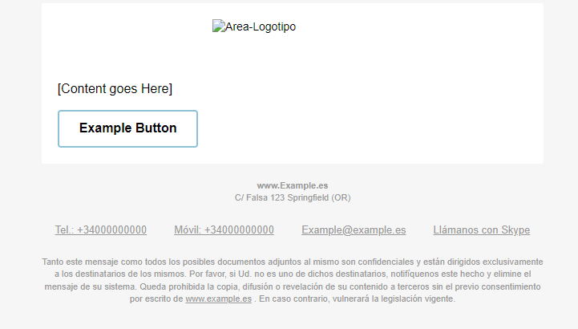

# Plantilla para el formato de Correo #

#### Plantilla para el diseño de correo. ####

La idea de esta plantilla consiste en un diseño sencillo, cada uno de los apartados como el logotipo o los servicios de contrato etc.

Hay que tener en cuenta que para maquetar en responsive es necesario usar "tables" en lugar de divs, mas abajo dejare una serie enlaces de bibliografia. Hay que introducir una serie de comentarios para que los pueda leer Outlet y IOS, de lo contrario habran incompatibilidades de formato y quedara feo. (Los enlaces estan en ingles)

En la carpeta "/alternative-template" se encuentran ejemplos de diseños extrasextraido de la [Web siguiente](https://webdesign.tutsplus.com/tutorials/creating-a-future-proof-responsive-email-without-media-queries--cms-23919)

[Web Responsive Tutorial](https://webdesign.tutsplus.com/tutorials/creating-a-future-proof-responsive-email-without-media-queries--cms-23919/ "Web responsive")

Otros enlaces:
[example](https://www.smashingmagazine.com/2017/01/introduction-building-sending-html-email-for-web-developers/ "Guia del web responsive cona algunos enlaces")

## Plantilla pera un correo automatizado usando las Rows de la tabla HTML. ##
Gran parte de las empresas grandes usan un formato para el correo en el cual a medida que haces "scroll" o ruedas hacia abajo aparece la información seguida como si fuera una rollo. Como ellos lo hacen nosotros no vamos a ser menos y ahi entra este formato. La ventaja de este formato es permitir automatizar la información sin poner en riesgo el formato que recibira el cliente.

La plantilla consiste en una tabla ya moldeada para ir introduciendo el contenido( ya sean imagenes, enlaces, botones...) mediante los "rows" o "tr td /td /tr" en el HTML, cada bloque de contenido es un row, por ejemplo el logotipo corproativo iria centrado arriba( se puede ajustar dentro de la celdilla por supuesto) y a continuación se podria incorporar la información del correo, ya sea un email escrito a mano , o una notificacion automatizada como el informar a los clientes de un determinado descuento. A la hora de maquetar y usar imagenes ha de cuidarse el "width" para no sobre pasar la celda. 

###TIPS Y CONSEJOS
-Mantener el diseño simple,a menos complejidad con etiquetas y atributos mas simples mas seguro sera que vaya todo. Hay atributos que no estan 100% soportados, por lo que vale la pena probarlos en otros correo. Por ejemplo no usar el position relative o el absolute
-En el tema de botones puede resultar interesante usar el span para darles forma o inclso meterlos como una imagen con enlace.
-Evitar la propiedad background-image-> problemas en outlook y en thunderbird.

# PHPMAILER #
En la carpeta "DemoEmailSender" se han se han colocado ua plantilla ejemplo simple para el PHPMAILER, la libreria se encuentra en la carpeta "PHPMailer-master" obtenida de la [pagina oficial de github de la libreria](https://github.com/PHPMailer/PHPMailer).

Se ha colocado un ejemplo adicional del funcionamiento sobre como funciona PHPMailer en la version 5.0.0 para comprar. 

-Como Apunte el puerto estandar suele ser el 25, hay que tener cuidado con la encriptacion puesto que si el servidor no tiene hay que obiarlo y si tiene otro puede dar problemas para enviar.
-Ademas para asignar contenido al cuerpo con formato HTML se recomienda usar la funcion de PHP "file_get_contents".
-La versiones de PHP usadas son para las pruebas de la version PHPMailer 6.0.0 es la 8.1.7.; para las pruebas de la version de PHPMailer 5.0.0 se ha usado la version de PHP 7.4.9. Estas se ha modificado con XAMPP.
[Documentacion sobre meta tags](https://responsivehtmlemail.com/html-email-metadata/).
