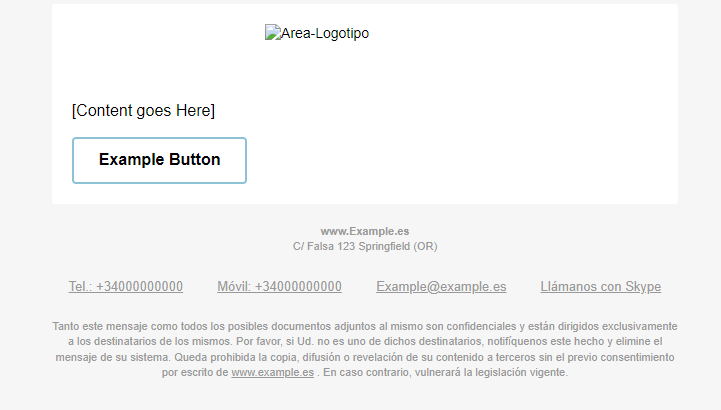

# Plantilla per al Correu #

#### Plantilla per a un correu de apliccació automatizat. ####

La idea de esta plantilla consiste en un diseño sencillo, cada uno de los apartados como el logotipo o los servicios de contrato etc.

Hay otra carpeta en la que se ha puesto un ejemplo completo extraido de la [Web siguiente](https://webdesign.tutsplus.com/tutorials/creating-a-future-proof-responsive-email-without-media-queries--cms-23919)

Hay que tener en cuenta que para maquetar en responsive es necesario usar <table></table> en lugar de divs, mas abajo dejare una serie enlaces de bibliografia. Hay que introducir una serie de comentarios para que los pueda leer Outlet y IOS, de lo contrario habran incompatibilidades de formato y quedara feo.
(Los enlaces estan en ingles)
[Web Responsive](https://webdesign.tutsplus.com/tutorials/creating-a-future-proof-responsive-email-without-media-queries--cms-23919/ "Web responsive")

Otros enlaces:
[example](https://www.smashingmagazine.com/2017/01/introduction-building-sending-html-email-for-web-developers/ "Guia del web responsive cona algunos enlaces")

#### Plantilla per a un correu de apliccació automatizat usant les Rows de la tabla HTML. ####
Gran parte de las empresas grandes usan un formato para el correo en el cual a medida que haces "scroll" o ruedas hacia abajo aparece la información seguida como si fuera una rollo. Como ellos lo hacen nosotros no vamos a ser menos y ahi entra este formato. 

La plantilla consiste en una tabla ya moldeada para ir introduciendo el contenido( ya sean imagenes, enlaces, botones...) medianto los "rows" o <tr><td></td></tr> en el HTML, cada bloque de contenido es un row, por ejemplo el logotipo corproativo iria centrado arriba( se `puede ajustar dentro de la celdilla por supuesto) y a continuación se podria incorporar la información del correo, ya sea un email escrito a mano , o una notificacion automatizada como el informar a los clientes de un determinado descuento. A la hora de maquetar y usar imagenes ha de cuidarse el "width" de esta i la distribución. 

###TIPS Y CONSEJOS###
-Mantener el diseño simple,a menos complejidad con etiquetas y atributos mas simples mas seguro sera que vaya todo. Hay atributos que no estan 100% soportados, por lo que vale la pena probarlos en otros correo. 
-En el tema de botones puede resultar interesante usar el span para darles forma o inclso meterlos como una imagen con enlace.
-Evitar la propiedad background-color-> problemas en outlook y en thunderbird.